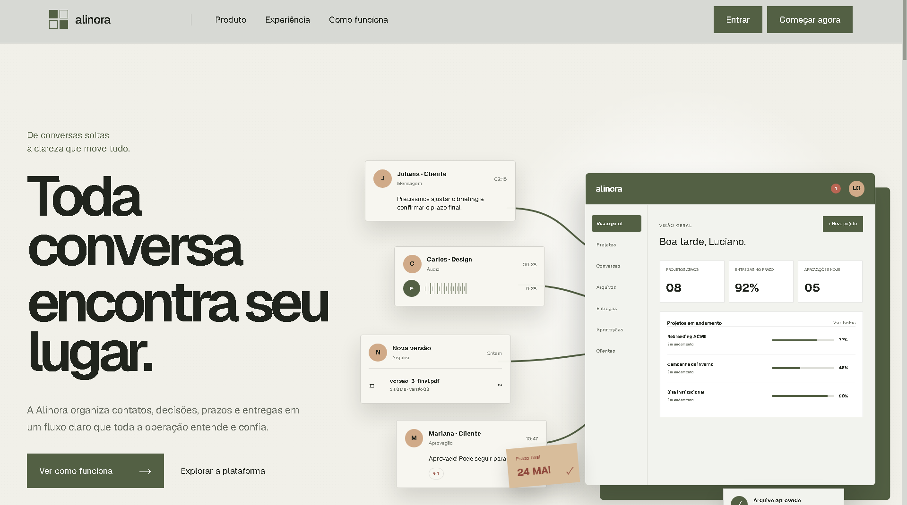
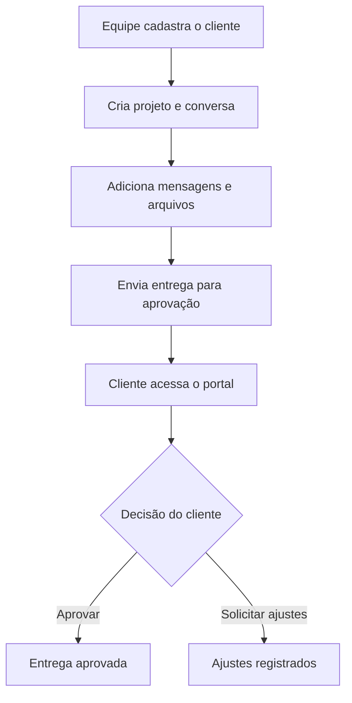
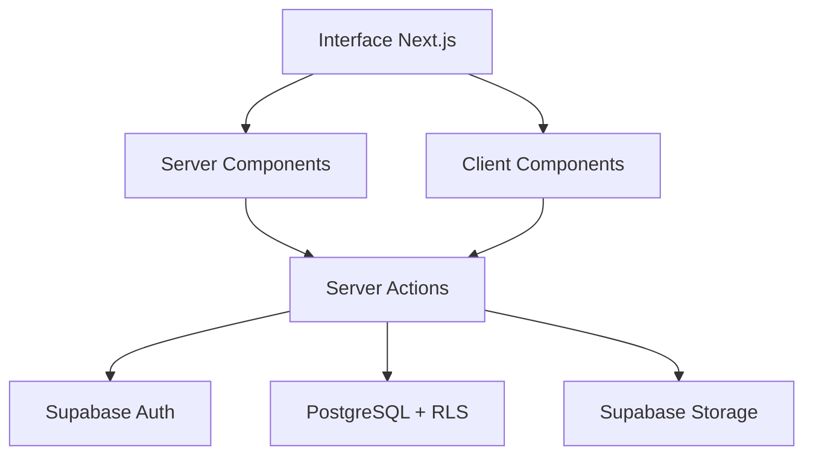

# Alinora

Uma plataforma SaaS conceitual para centralizar conversas, arquivos, entregas e aprovações entre equipes e clientes.

[Visualizar projeto](https://alinora-saas.vercel.app) · [Repositório](https://github.com/euluciano2222-cmyk/alinora-saas)



## Sobre o projeto

A Alinora foi criada para resolver um problema comum em projetos de prestação de serviços: informações importantes espalhadas entre mensagens, arquivos e diferentes canais de comunicação.

A plataforma organiza todo o contexto operacional em um único ambiente, permitindo que a equipe acompanhe clientes, projetos, conversas, documentos e solicitações de aprovação.

O cliente possui um portal separado, no qual pode visualizar entregas, acessar arquivos, responder conversas e registrar decisões.

> **Aviso:** a Alinora é um projeto conceitual desenvolvido exclusivamente para fins educacionais e de portfólio. Não representa uma empresa ou produto comercial e não possui vínculo com outras marcas que utilizem o mesmo nome.

## Demonstração

A aplicação está publicada na Vercel:

**https://alinora-saas.vercel.app**

Algumas áreas exigem autenticação e permissões específicas para preservar a separação entre o painel da equipe e o portal do cliente.

## Principais funcionalidades

### Painel da equipe

- Dashboard com indicadores operacionais reais
- Cadastro e gerenciamento de clientes
- Organização de projetos por cliente
- Criação e acompanhamento de conversas
- Histórico completo de mensagens
- Alteração do status das conversas
- Notas internas visíveis somente para a equipe
- Upload e gerenciamento de arquivos
- Arquivos públicos ou restritos à equipe
- Solicitações de entrega e aprovação
- Cancelamento controlado de entregas pendentes
- Convites de acesso para clientes
- Separação entre membros, administradores e proprietários

### Portal do cliente

- Ativação segura por convite
- Visualização das entregas disponíveis
- Acesso a arquivos autorizados
- Aprovação de entregas
- Solicitação de ajustes
- Histórico de decisões
- Visualização das conversas vinculadas
- Envio de mensagens para a equipe
- Isolamento dos dados por cliente e organização

## Fluxo principal



## Tecnologias

- [Next.js 16](https://nextjs.org/)
- [React 19](https://react.dev/)
- [TypeScript](https://www.typescriptlang.org/)
- [Supabase](https://supabase.com/)
- [Tailwind CSS 4](https://tailwindcss.com/)
- [GSAP](https://gsap.com/)
- [Radix UI](https://www.radix-ui.com/)
- [shadcn/ui](https://ui.shadcn.com/)
- [Lucide React](https://lucide.dev/)
- [Vercel](https://vercel.com/)

## Arquitetura

A aplicação utiliza o App Router do Next.js, combinando Server Components, Client Components e Server Actions.



### Organização geral

```text
src/
├── app/
│   ├── auth/
│   ├── convite/
│   ├── dashboard/
│   │   ├── arquivos/
│   │   ├── clientes/
│   │   ├── conversas/
│   │   ├── entregas/
│   │   ├── projetos/
│   │   └── configuracoes/
│   ├── portal/
│   │   └── conversas/
│   ├── login/
│   ├── recuperar-senha/
│   └── atualizar-senha/
├── components/
├── lib/
│   └── supabase/
└── types/

supabase/
└── migrations/
```

## Segurança

A segurança foi tratada como parte central da arquitetura do projeto.

Entre as medidas utilizadas estão:

- Autenticação pelo Supabase Auth
- Row Level Security no PostgreSQL
- Isolamento dos dados por organização
- Separação entre acesso da equipe e acesso do cliente
- Verificação de autorização nas Server Actions
- Políticas específicas para leitura, criação e atualização
- Buckets privados no Supabase Storage
- URLs temporárias para acesso aos arquivos
- Validação de tipo e tamanho dos uploads
- Proteção de campos sensíveis por triggers
- Histórico de alterações de status
- Controle de papéis dentro da organização
- Middleware para proteção das rotas
- Variáveis de ambiente fora do versionamento

Nenhuma chave privada ou credencial deve ser adicionada ao repositório.

## Modelo de dados

As principais entidades da aplicação são:

- Organizações
- Membros da organização
- Clientes
- Projetos
- Conversas
- Mensagens
- Arquivos
- Entregas e aprovações
- Convites de acesso
- Tarefas
- Análises auxiliares

As relações e regras de acesso são mantidas pelo PostgreSQL e pelas políticas de segurança do Supabase.

## Rotas principais

| Rota | Descrição |
|---|---|
| `/` | Landing page |
| `/login` | Autenticação |
| `/recuperar-senha` | Recuperação de senha |
| `/atualizar-senha` | Definição de uma nova senha |
| `/dashboard` | Visão operacional da equipe |
| `/dashboard/clientes` | Gestão de clientes |
| `/dashboard/projetos` | Gestão de projetos |
| `/dashboard/conversas` | Central de conversas |
| `/dashboard/arquivos` | Biblioteca de arquivos |
| `/dashboard/entregas` | Entregas e aprovações |
| `/convite/[accessId]` | Ativação do convite do cliente |
| `/portal` | Entregas disponíveis para o cliente |
| `/portal/conversas` | Conversas do cliente |

## Executando localmente

### Requisitos

- Node.js
- npm
- Projeto configurado no Supabase

### Instalação

```bash
git clone https://github.com/euluciano2222-cmyk/alinora-saas.git
cd alinora-saas
npm install
```

Crie um arquivo `.env.local` na raiz do projeto:

```env
NEXT_PUBLIC_SUPABASE_URL=sua_url_do_supabase
NEXT_PUBLIC_SUPABASE_PUBLISHABLE_KEY=sua_chave_publica_do_supabase
```

Inicie o ambiente de desenvolvimento:

```bash
npm run dev
```

A aplicação ficará disponível em:

```text
http://localhost:3000
```

## Verificação

Execute o build de produção:

```bash
npm run build
```

Execute também a análise estática:

```bash
npm run lint
```

## Deploy

O projeto utiliza integração contínua entre GitHub e Vercel.

Cada atualização enviada para a branch principal gera automaticamente um novo deploy de produção.

O banco de dados, a autenticação e o armazenamento são fornecidos pelo Supabase.

## Objetivos técnicos demonstrados

Este projeto foi desenvolvido para demonstrar conhecimentos em:

- Desenvolvimento full-stack com Next.js
- Modelagem de banco de dados relacional
- Autenticação e autorização
- Row Level Security
- Server Components e Server Actions
- Upload seguro de arquivos
- Controle de acesso baseado em papéis
- Organização de aplicações SaaS
- Interfaces responsivas
- Deploy e integração contínua
- Git e GitHub
- Segurança aplicada ao desenvolvimento web

## Autor

Desenvolvido por **Luciano Oliveira** como projeto de estudo e portfólio.

[GitHub](https://github.com/euluciano2222-cmyk)